# HelloWorld GKE

Ứng dụng Flask đơn giản triển khai trên Google Kubernetes Engine (GKE).

## Cấu trúc dự án

- `app.py`: Ứng dụng Flask trả về "Hello World".
- `Dockerfile`: Định nghĩa cách build Docker image cho ứng dụng.
- `deployment.yaml`: Manifest Kubernetes để deploy ứng dụng lên GKE.
- `service.yaml`: Manifest Kubernetes để expose ứng dụng qua LoadBalancer.
- `.dockerignore`: Các file/folder bị loại trừ khi build Docker image.

## Hướng dẫn sử dụng

### 1. Google Cloud Initialization

```bash
gcloud init
```
Sau đó là các bước config Google Cloud
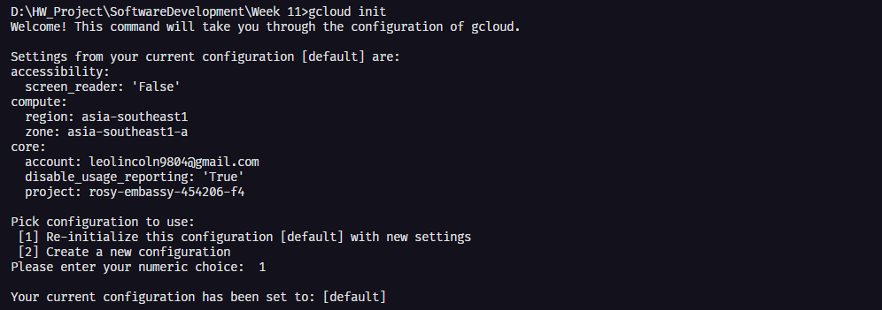

### 2. Tải Kubectl
```bash
gcloud components install kubectl
```

### 3. Tạo repo trong Artifact Registry
```bash
gcloud artifacts repositories create hello-repo \
    --project=$projectID \
    --repository-format=docker \
    --location=us-central1 \
    --description=""
```
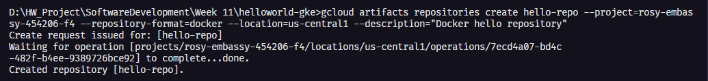

### 4. Build và Push
```bash
gcloud builds submit --tag us-central1-docker.pkg.dev/rosy-embassy-454206-f4/hello-repo/helloworld-gke .
```
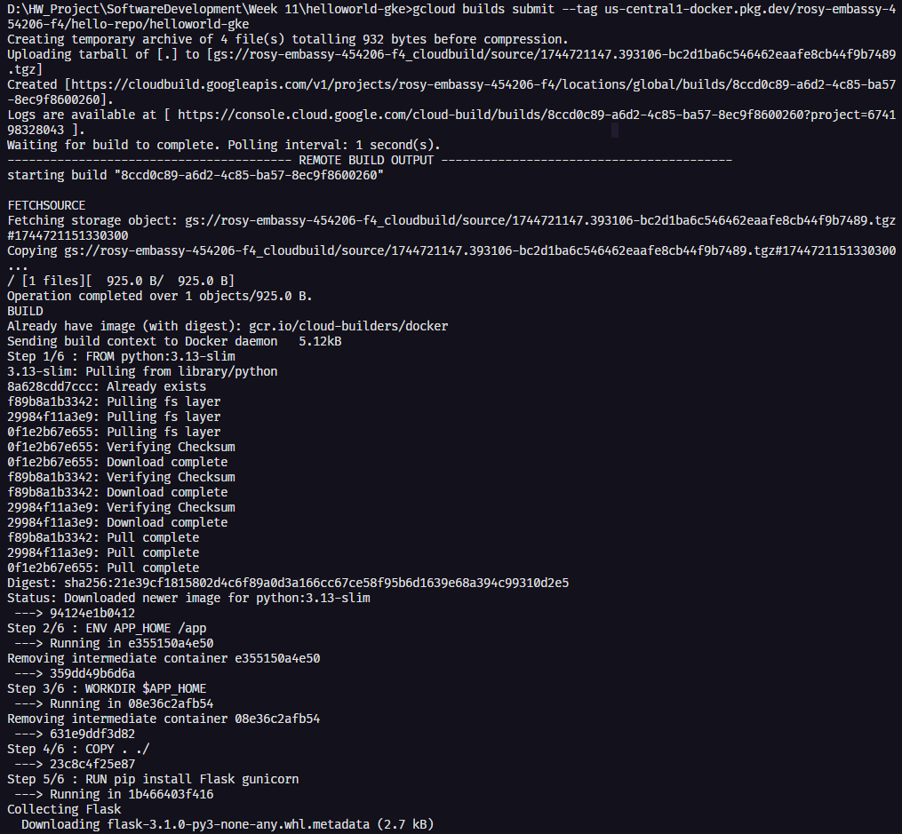

### 5. Tạo Cluster
```bash
gcloud container clusters create-auto helloworld-gke --location us-central1
```
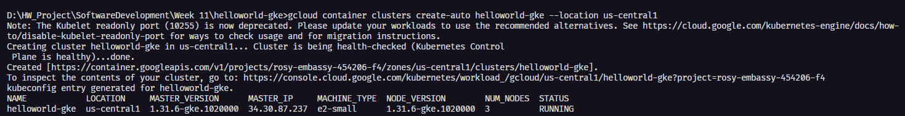

### 6. Deployement
```bash
kubectl apply -f deployment.yaml
kubectl apply -f service.yaml
```
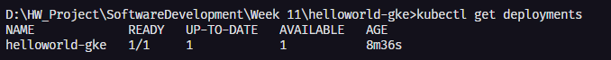
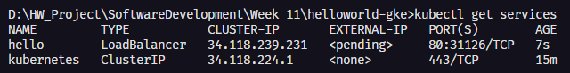


### 7. Mornitoring trên Cloud 
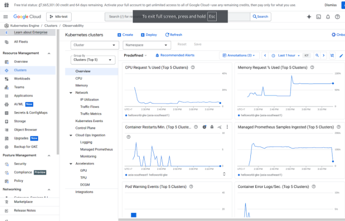
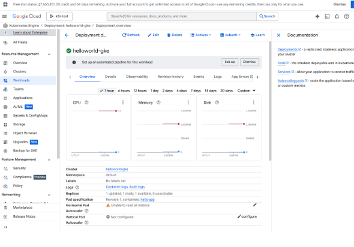

### 8. Scalability
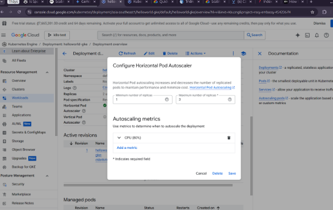

Stress test với Jmeter
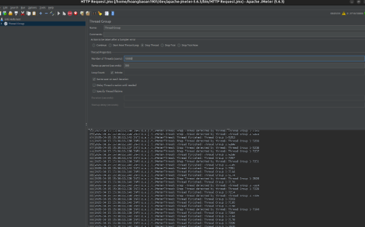

Trước quá trình stress test, deployment chỉ có 1 pod, còn sau đó
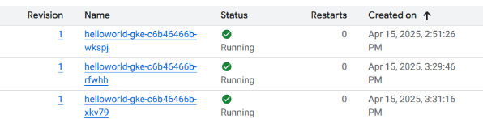